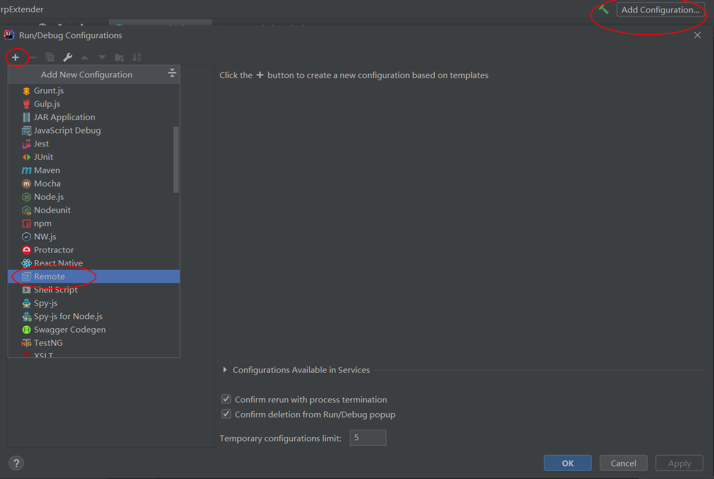
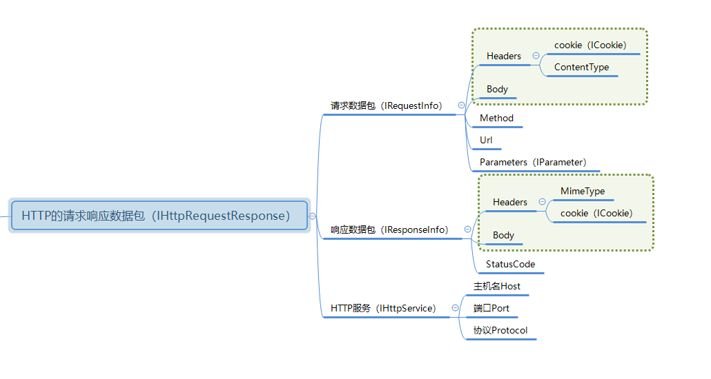

# burp api drops

API快速索引 ：

| burp api                         | 相关课程                                   | 示例代码                                                     |
| -------------------------------- | ------------------------------------------ | ------------------------------------------------------------ |
| IBurpCollaboratorClientContext   |                                            |                                                              |
| IBurpCollaboratorInteraction     |                                            |                                                              |
| IBurpExtender                    | 第二课：开发环境准备和Hello World          | https://github.com/PortSwigger/example-hello-world/blob/master/java/BurpExtender.java |
| IBurpExtenderCallbacks           | 第二课：开发环境准备和Hello World          | https://github.com/PortSwigger/example-hello-world/blob/master/java/BurpExtender.java |
| IContextMenuFactory              |                                            |                                                              |
| IContextMenuInvocation           |                                            |                                                              |
| ICookie                          |                                            |                                                              |
| IExtensionHelpers                |                                            |                                                              |
| IExtensionStateListener          |                                            |                                                              |
| IHttpListener                    | 第五课：HTTP数据包的处理（获取\修改\发送） | https://github.com/PortSwigger/example-traffic-redirector/blob/master/java/BurpExtender.java<br />https://github.com/PortSwigger/custom-logger/blob/master/java/BurpExtender.java |
| IHttpRequestResponse             | 第五课：HTTP数据包的处理（获取\修改\发送） | https://github.com/PortSwigger/example-traffic-redirector/blob/master/java/BurpExtender.java<br />https://github.com/PortSwigger/custom-logger/blob/master/java/BurpExtender.java |
| IHttpRequestResponsePersisted    |                                            |                                                              |
| IHttpRequestResponseWithMarkers  |                                            |                                                              |
| IHttpService                     |                                            |                                                              |
| IInterceptedProxyMessage         |                                            |                                                              |
| IIntruderAttack                  |                                            |                                                              |
| IIntruderPayloadGenerator        |                                            |                                                              |
| IIntruderPayloadGeneratorFactory |                                            |                                                              |
| IIntruderPayloadProcessor        |                                            |                                                              |
| IMenuItemHandler                 |                                            |                                                              |
| IMessageEditor                   |                                            |                                                              |
| IMessageEditorController         |                                            |                                                              |
| IMessageEditorTab                |                                            |                                                              |
| IMessageEditorTabFactory         |                                            |                                                              |
| IParameter                       |                                            |                                                              |
| IProxyListener                   |                                            |                                                              |
| IRequestInfo                     |                                            |                                                              |
| IResponseInfo                    |                                            |                                                              |
| IResponseKeywords                |                                            |                                                              |
| IResponseVariations              |                                            |                                                              |
| IScanIssue                       |                                            |                                                              |
| IScannerCheck                    |                                            |                                                              |
| IScannerInsertionPoint           |                                            |                                                              |
| IScannerInsertionPointProvider   |                                            |                                                              |
| IScannerListener                 |                                            |                                                              |
| IScanQueueItem                   |                                            |                                                              |
| IScopeChangeListener             |                                            |                                                              |
| ISessionHandlingAction           |                                            |                                                              |
| ITab                             |                                            |                                                              |
| ITempFile                        |                                            |                                                              |
| ITextEditor                      |                                            |                                                              |


# 一、Burp插件介绍和编程语言选择


## 插件是什么？

扩展burp功能的程序，依赖burp提供的API，让使用者可以开发一些自己想要的功能。


## 插件可以干什么？

请求和响应包的修改：比如在每个请求包中加如自定义的header

自定义UI界面：插件可以实现一个自己的tab，方便图像化操作

自定义扫描插件：当出现了新的漏洞，我们就可以编写自己的扫描插件，来自动化发现这类漏洞

访问burp中的一些关键数据：比如proxy中的请求记录、sitemap中请求响应、扫描发现的漏洞（issue）


## 插件怎么使用？

先讲burp插件的基本使用：加载安装、卸载、排序

插件的加载，可以从burp官方的BApp Store中进行加载安装


也可加载一些外部插件。


加载后burp才会起作用，可以通过点击这个选择框来启用或禁用插件。


值得注意的是：图形界面中的顺序，就是插件被调用的顺序！我们可以通过 Up或Down来调整插件的顺序。

当多个插件有相同的操作时，比如修改请求数据包，插件的顺序就可能影响最后的请求数据包的内容。

## 插件怎么开发？

这是我们这个系列课程的核心主题，后续的章节就是围绕这个主题进行的。


## 编程语言的选择

burp suite支持三种编程语言开发的插件:

- Java
- python
- ruby

我们选择Java，为什么选择Java？原因有三：

1、兼容性

之前也用python写过几个简单插件。遇到过一种情况，当需要调用的外部类包含遇到pyd文件就无法进行下去了，因为pyd是C写的，Jython是无法使用C写的模块的。burp本身是Java写的，使用Java去开发插件兼容性最高，会少很多莫名其妙的错误。


下面这个链接对此有详细说明：http://stackoverflow.com/questions/16218183/using-pyd-library-in-jython

2、调试

当使用python写插件进行调试时，只能尽量通过输出去获取信息，没有好的办法进行下断点动态调试。而Java 则可以，对于复杂逻辑的插件，Java编写的更容易排查问题。

3、打包

是burp写的插件可以打包成一个独立的Jar包，方便移动和传播，环境配置也更简单。


综上，Java是写burp插件的最佳的选择。


# 二、开发环境准备和Hello World

## 环境搭建

### JDK安装

在Oracle官网可以找到各种版本JDK的[下载地址](https://www.oracle.com/java/technologies/oracle-java-archive-downloads.html) ，我们选择[JDK8](https://www.oracle.com/java/technologies/javase/javase8u211-later-archive-downloads.html#license-lightbox)，并且将java.exe所在目录加入系统环境变量。

### IDEA 或 Eclipse

推荐使用IDEA，它的调试功能比较好用。

### maven

https://maven.apache.org/download.cgi


下载后解压，然后将mvn.cmd所在目录加入环境变量即可。

## 国际惯例hello world

https://github.com/PortSwigger/example-hello-world/blob/master/java/BurpExtender.java

### 依赖包的管理

```xml
<project xmlns="http://maven.apache.org/POM/4.0.0"
    xmlns:xsi="http://www.w3.org/2001/XMLSchema-instance"
    xsi:schemaLocation="http://maven.apache.org/POM/4.0.0 http://maven.apache.org/xsd/maven-4.0.0.xsd">
    <modelVersion>4.0.0</modelVersion>
    <groupId>com.bit4woo.burp</groupId>
    <artifactId>domain_hunter</artifactId>
    <version>1.4</version>
    <build>
        <sourceDirectory>src</sourceDirectory>
        <plugins>
            <plugin>
                <artifactId>maven-compiler-plugin</artifactId>
                <version>3.7.0</version>
                <configuration>
                    <source>1.8</source>
                    <target>1.8</target>
                </configuration>
            </plugin>

            <plugin>
                <artifactId>maven-assembly-plugin</artifactId>
                <configuration>
                    <descriptorRefs>
                        <descriptorRef>jar-with-dependencies</descriptorRef>
                    </descriptorRefs>
                    <archive>
                        <manifest>
                            <addDefaultImplementationEntries>
                                true<!--to get Version from pom.xml -->
                            </addDefaultImplementationEntries>
                        </manifest>
                    </archive>
                </configuration>
                <executions>
                    <execution>
                        <id>make-assembly</id>
                        <phase>package</phase>
                        <goals>
                            <goal>single</goal>
                        </goals>
                    </execution>
                </executions>
            </plugin>

        </plugins>
    </build>
    <dependencies>
        <!-- https://mvnrepository.com/artifact/net.portswigger.burp.extender/burp-extender-api -->
        <dependency>
            <groupId>net.portswigger.burp.extender</groupId>
            <artifactId>burp-extender-api</artifactId>
            <version>1.7.22</version>
        </dependency>

        <!-- https://mvnrepository.com/artifact/com.google.code.gson/gson -->
        <dependency>
            <groupId>com.google.code.gson</groupId>
            <artifactId>gson</artifactId>
            <version>2.8.6</version>
        </dependency>

        <!-- to get root domain -->
        <dependency>
            <groupId>com.google.guava</groupId>
            <artifactId>guava</artifactId>
            <version>29.0-jre</version>
        </dependency>

        <!-- https://mvnrepository.com/artifact/org.apache.commons/commons-text -->
        <dependency>
            <groupId>org.apache.commons</groupId>
            <artifactId>commons-text</artifactId>
            <version>1.6</version>
        </dependency>

        <!-- https://mvnrepository.com/artifact/org.beanshell/bsh -->
        <dependency>
            <groupId>org.beanshell</groupId>
            <artifactId>bsh</artifactId>
            <version>2.0b5</version>
        </dependency>
    </dependencies>
</project>
```

### 插件程序的规范

```java
package burp;

import java.io.PrintWriter;

public class BurpExtender implements IBurpExtender
{
    @Override
    public void registerExtenderCallbacks(IBurpExtenderCallbacks callbacks)
    {
        // 设置插件的名称
        callbacks.setExtensionName("Hello world extension");
        
        // 获取burp提供的标准输出流和错误输出流
        PrintWriter stdout = new PrintWriter(callbacks.getStdout(), true);
        PrintWriter stderr = new PrintWriter(callbacks.getStderr(), true);
        
        // 打印到标准输出流
        stdout.println("Hello output");
        
        // 答应到错误输出流
        stderr.println("Hello errors");
        
        // 写一个报警信息到burp的报警面板
        callbacks.issueAlert("Hello alerts");
        
        // 抛出一个异常，将会在错误输出流中显示
        throw new RuntimeException("Hello exceptions");
    }
}
```


- 所有的burp插件都必须实现IBurpExtender这个接口
- 实现类的包名称必须是burp
- 实现类的名称必须是BurpExtender
- 实现类比较是public的
- 实现类必须有默认构造函数（public，无参），如果没有定义构造函数就是默认构造函数

### callbacks对象的作用

通过 callbacks 这个实例对象，传递给插件一系列burp的原生方法。我们需要实现的很多功能都需要调用这些方法。


# 三、动态调试方法

## IDEA的配置




## burp端的启动参数

```
java -agentlib:jdwp=transport=dt_socket,server=y,suspend=n,address=5005 -jar burpsuite_pro_v2020.2.1.jar
pause
```

## 破解版burp的调试方法

国内我们用的burp版本大家都懂的，一般都是破解版（使用Keygen或者helper的都有），如果要使用破解版进行调试，可以使用如下命令行参数启动burp，然后运行burp的JVM将处于监听状态，5005端口。

```
java -agentlib:jdwp=transport=dt_socket,server=y,suspend=n,address=5005 -Xbootclasspath/p:burp-loader-keygen-70yeartime-BurpPro.jar -jar burpsuite_pro_v1.7.37.jar

java -agentlib:jdwp=transport=dt_socket,server=y,suspend=n,address=5005 -Xbootclasspath/p:BurpHelper2019.jar -jar burpsuite_pro_v1.7.37.jar
```

这个命令和正版不同的地方就是需要加 Xbootclasspath/p: 这一段，可以保存个bat，方便一键启动。

## 使用logger++分析数据包帮助调试

如果是写扫描插件、或者其他需要修改请求响应包的插件，我们可以使用logger++来帮助我们查看修改后的请求响应包。


# 四、学习思路和核心逻辑

## 向官方文档和API学习

官方教学文档和API文档一定是最权威的，如果有问题，首先找官方文档。

官方各种示例代码：https://portswigger.net/burp/extender

官方API文档：https://portswigger.net/burp/extender/api/

比如选择有一个需求，要获取请求包的某个header的值，但是不知道怎么做，那么我们可以尝试在API中找关键词：


## 向已有的优秀插件学习

可以找BApp Store上的类似功能的插件，查看他们的源码，学习作者的实现思路。


如果是非官方的BApp Store的项目，还可以直接反编译它的Jar包，查看其代码，[JD-GUI](http://java-decompiler.github.io/)了解一下

## burp中的核心对象

burp中最为核心的对象就是HTTP数据包，我们的所有操作、各种API接口都是围绕HTTP数据包展开的。




## 插件的调用逻辑


以HttpListener为例说明一下【burp主程序】和【burp插件程序】之间的调用关系。

第一步：burp插件被加载时，【burp主程序】就会去调用BurpExtender类中的registerExtenderCallbacks方法。【burp插件程序】就是通过这个方法，在其中注册HttpListener，其目的就是告诉【burp主程序】当前HttpListener对象的存在。类似地，Factory等其他需要由burp主程序主动调用或通知的对象，也需要在这个函数中完成注册。

第二步：当【burp主程序】的某个组件产生了一个请求或者响应包（比如Proxy收到了一个来自浏览的请求，Scanner主动发起了一个扫描请求，Scanner收到了扫描请求的响应包等等）都会主动通知各个已知HttpListener对象。类似地，Factory等其他对象，也会在不同的场景下被通知或者别调用，比如ExtensionStateListener，会在burp插件取消加载的时候被通知。

第三步：【burp插件程序】中的HttpListener对象在收到通知信息后，执行自己特定的逻辑（processHttpMessage函数中），进行数据包的修改或者分析。类似地，其他对象也都有实现自己逻辑的函数。

## 需要主动注册的对象

他们的共通特定是：会被burp主程序主动调用或者主动通知，burp主程序必须知道它们的存在，才能完成对应的功能。

### 各种事件监听器

ExtensionStateListener

HttpListener

ProxyListener

ScannerListener

ScopeChangeListener

### 各种对象构造工厂

ContextMenuFactory

MessageEditorTabFactory

IntruderPayloadGeneratorFactory

### 其他

ScannerInsertionPointProvider

ScannerCheck

IntruderPayloadProcessor

SessionHandlingAction

MenuItem


演示代码

https://github.com/PortSwigger/example-event-listeners/blob/master/java/BurpExtender.java

# 五、HTTP数据包的处理（获取\修改\更新）

### 处理http请求

1. 获取：request中的header，body，paramaters

```java
IRequestInfo analyzeRequest = helpers.analyzeRequest(messageInfo); //对消息体进行解析


//**************获取参数 通过IRequestInfo对象*************************//
List<IParameter> paraList = analyzeRequest.getParameters();
//当body是json格式的时候，这个方法也可以正常获取到键值对；
//但是PARAM_JSON等格式不能通过updateParameter方法来更新。
//如果在url中的参数的值是 xxx=json格式的字符串 这种形式的时候，getParameters应该是无法获取到最底层的键值对的。
for (IParameter para : paraList){
    byte type= para.getType(); //获取参数的类型
    String key = para.getName(); //获取参数的名称
    String value = para.getValue(); //获取参数的值
}
//参数共有7种格式，0是URL参数，1是body参数，2是cookie参数，6是json格式参数


//**************获取headers 通过IRequestInfo对象*************************//
List<String> headers = analyzeRequest.getHeaders();


//**************获取body 通过String格式的request截取*************************//
int bodyOffset = analyzeRequest.getBodyOffset();

byte[] byte_Request = messageInfo.getRequest();//当需要byte[]和string格式的请求包时用这个方法！
String request = new String(byte_Request); //byte[] to String

String body = request.substring(bodyOffset);
byte[] byte_body = body.getBytes();  //String to byte[]

```

2. 修改：

```
修改实质就是对byte[]、String 变量的操作。毋庸赘述。
```


2. 更新：

```java
//***********************方法一：更新参数**********************
//参数共有7种格式，0是URL参数，1是body参数，2是cookie参数 （helpers.updateParameter只支持这三种）

IParameter newPara = helpers.buildParameter(key, Value, para.getType()); //构造新的参数
new_Request = helpers.updateParameter(new_Request, newPara); //构造新的请求包；关键方法
//不支持更新Json格式的参数，要注意！！！
messageInfo.setRequest(new_Request);//设置最终新的请求包


//***********************方法二：更新header或body********************************
//如果修改了header或者数修改了body，不能通过updateParameter，使用这个方法。
//6是json参数--这种参数的更新用更新body的方法。

List<String> headers = analyzeRequest.getHeaders();
byte[] bodyByte = newBody.getBytes();
byte[] new_Request = helpers.buildHttpMessage(headers, bodyByte); //关键方法
messageInfo.setRequest(new_Request);//设置最终新的请求包
```


### 处理HTTP响应

```java
//**************************获取***********************************
IResponseInfo analyzedResponse = helpers.analyzeResponse(messageInfo.getResponse()); //getResponse获得的是字节序列byte[]
short statusCode = analyzedResponse.getStatusCode();
List<String> headers = analyzedResponse.getHeaders();
String resp = new String(messageInfo.getResponse());
int bodyOffset = analyzedResponse.getBodyOffset();//响应包是没有参数的概念的，大多需要修改的内容都在body中
String body = resp.substring(bodyOffset);


//***************************更新********************************
byte[] bodybyte = newBody.getBytes();
messageInfo.setResponse(helpers.buildHttpMessage(headers, bodybyte));
```


### 扫描插件中更新请求的方法

```java

String paraName = insertionPoint.getInsertionPointName(); //实在就是参数名
String paraValue = insertionPoint.getBaseValue();//实质就是原始值
byte[] modifiedRawRequest = insertionPoint.buildRequest(payload.getBytes());//用payload的值【替换】原始的值；
//insertionPoint可以是参数值、整个body、新增的URL参数、新增的body参数；但没有定义【参数名】的注入点，如果想要用payload替换参数名，就需要自己实现了（通过更改参数的方式），

long sendTime = System.currentTimeMillis();
IHttpRequestResponse checkRequestResponse = callbacks.makeHttpRequest(
baseRequestResponse.getHttpService(), modifiedRawRequest);
```


### 常用HTTP信息获取方法

```java
package burp;

import java.net.URL;
import java.util.Arrays;
import java.util.List;

public class Getter {
    private static IExtensionHelpers helpers;
    public Getter(IExtensionHelpers helpers) {
    	this.helpers = helpers;
    }
    
	public List<String> getHeaders(boolean messageIsRequest,IHttpRequestResponse messageInfo) {
		if(messageIsRequest) {
			IRequestInfo analyzeRequest = helpers.analyzeRequest(messageInfo);
			List<String> headers = analyzeRequest.getHeaders();
			return headers;
		}else {
			IResponseInfo analyzeResponse = helpers.analyzeResponse(messageInfo.getResponse());
			List<String> headers = analyzeResponse.getHeaders();
			return headers;
		}
	}
	
	
	public byte[] getBody(boolean messageIsRequest,IHttpRequestResponse messageInfo) {
		if(messageIsRequest) {
			IRequestInfo analyzeRequest = helpers.analyzeRequest(messageInfo);
			int bodyOffset = analyzeRequest.getBodyOffset();
			byte[] byte_Request = messageInfo.getRequest();
			
			byte[] byte_body = Arrays.copyOfRange(byte_Request, bodyOffset, byte_Request.length);//not length-1
			//String body = new String(byte_body); //byte[] to String
			return byte_body;
		}else {
			IResponseInfo analyzeResponse = helpers.analyzeResponse(messageInfo.getResponse());
			int bodyOffset = analyzeResponse.getBodyOffset();
			byte[] byte_Request = messageInfo.getResponse();
			
			byte[] byte_body = Arrays.copyOfRange(byte_Request, bodyOffset, byte_Request.length);//not length-1
			return byte_body;
		}
	}
	
	public String getShortUrl(IHttpRequestResponse messageInfo) {
		return messageInfo.getHttpService().toString();
	}
	
	public URL getURL(IHttpRequestResponse messageInfo){
		IRequestInfo analyzeRequest = helpers.analyzeRequest(messageInfo);
		return analyzeRequest.getUrl();
	}
	
	public String getHost(IHttpRequestResponse messageInfo) {
		return messageInfo.getHttpService().getHost();
	}
	
	public short getStatusCode(IHttpRequestResponse messageInfo) {
		IResponseInfo analyzedResponse = helpers.analyzeResponse(messageInfo.getResponse());
		return analyzedResponse.getStatusCode();
	}
	public List<IParameter> getParas(IHttpRequestResponse messageInfo){
		IRequestInfo analyzeRequest = helpers.analyzeRequest(messageInfo);
		return analyzeRequest.getParameters();
	}
}

```


### 一段完整的示例代码

```java
package burp;

import java.util.ArrayList;
import java.util.List;
import java.io.PrintWriter;
import java.net.URLEncoder;
import custom.Unicode;


public class BurpExtender implements IBurpExtender, IHttpListener
{//所有burp插件都必须实现IBurpExtender接口，而且实现的类必须叫做BurpExtender
    private IBurpExtenderCallbacks callbacks;
    private IExtensionHelpers helpers;
    
    private PrintWriter stdout;
    private String ExtenderName = "burp extender api drops by bit4";
    private List<String> paraWhiteList = new ArrayList<String>();
    
    @Override
    public void registerExtenderCallbacks(IBurpExtenderCallbacks callbacks)
    {//IBurpExtender，必须实现的方法
    	stdout = new PrintWriter(callbacks.getStdout(), true);
    	callbacks.printOutput(ExtenderName);
    	//stdout.println(ExtenderName);
        this.callbacks = callbacks;
        helpers = callbacks.getHelpers();
        callbacks.setExtensionName(ExtenderName); 
        callbacks.registerHttpListener(this); //如果没有注册，下面的processHttpMessage方法是不会生效的。处理请求和响应包的插件，这个应该是必要的
    }

    @Override
    public void processHttpMessage(int toolFlag,boolean messageIsRequest,IHttpRequestResponse messageInfo)
    {
    	if (toolFlag == (toolFlag&checkEnabledFor(callbacks))){
    		//不同的toolFlag代表了不同的burp组件 https://portswigger.net/burp/extender/api/constant-values.html#burp.IBurpExtenderCallbacks
        	example(messageIsRequest, messageInfo);
    	}
    }
    
    public void example(boolean messageIsRequest,IHttpRequestResponse messageInfo){
		if (messageIsRequest){ //对请求包进行处理
			
			int flag = 3;//当我们需要修改一个HTTP request，一般会涉及3部分：parameters\body\headers
			IRequestInfo analyzeRequest;
			
			switch (flag) {
			case 1://修改参数部分 parameters
			{
				analyzeRequest = helpers.analyzeRequest(messageInfo); 
				//对消息体进行解析,messageInfo是整个HTTP请求和响应消息体的总和，各种HTTP相关信息的获取都来自于它，HTTP流量的修改都是围绕它进行的。
    			
    			List<IParameter> paraList = analyzeRequest.getParameters();
    			//the method of get parameter
    			//当body是json格式的时候，这个方法也可以正常获取到键值对；但是PARAM_JSON等格式不能通过updateParameter方法来更新。
                //如果在url中的参数的值是 key=json格式的字符串 这种形式的时候，getParameters应该是无法获取到最底层的键值对的。
    			
    			byte[] new_Request = messageInfo.getRequest();
    			
    			
    			for (IParameter para : paraList){// 循环获取参数，判断类型，进行加密处理后，再构造新的参数，合并到新的请求包中。
    				if ((para.getType() == 0 || para.getType() == 1) && !paraWhiteList.contains(para.getName())){ 
    					//getTpe()就是来判断参数是在那个位置的，cookie中的参数是不需要进行加密处理的。还要排除白名单中的参数。
	    				//参数共有7种格式，0是URL参数，1是body参数，2是cookie参数 （helpers.updateParameter只支持这三种）
    					//6是json参数--这种参数的更新用更新body的方法。
    					String key = para.getName(); //获取参数的名称
	    				String value = para.getValue(); //获取参数的值
	    				//stdout.println(key+":"+value);
	    				String changedValue;
						try {
							changedValue = value+"*********************";
							changedValue = URLEncoder.encode(changedValue); //还要进行URL编码，否则会出现= 等特殊字符导致参数判断异常;
		    				//stdout.println(key+":"+value+":"+encryptedValue); //输出到extender的UI窗口，可以让使用者有一些判断
							
		    				IParameter newPara = helpers.buildParameter(key, changedValue, para.getType()); //构造新的参数
		    				new_Request = helpers.updateParameter(new_Request, newPara); //构造新的请求包
		    				messageInfo.setRequest(new_Request);//设置最终新的请求包
		    				
						} catch (Exception e) {
							
							callbacks.printError(e.getMessage());
						}
    				}
    			}
				break;
			}
			case 2://处理对象是header的情况
			{
    			//the method of get header
				analyzeRequest = helpers.analyzeRequest(messageInfo); //前面的操作可能已经修改了请求包，所以做后续的更改前，都需要从新获取。
				List<String> headers = analyzeRequest.getHeaders();
    			break;
			}
    		case 3:
    		{
    			//the method of get body
    			analyzeRequest = helpers.analyzeRequest(messageInfo); //前面的操作可能已经修改了请求包，所以做后续的更改前，都需要从新获取。
    			List<String> headers = analyzeRequest.getHeaders();//签名header可能已经改变，需要重新获取
    			int bodyOffset = analyzeRequest.getBodyOffset();
    			byte[] byte_Request = messageInfo.getRequest();
    			String request = new String(byte_Request); //byte[] to String
                String body = request.substring(bodyOffset);
                byte[] byte_body = body.getBytes();  //String to byte[]
                
				try {
					String newBody = body+"$$$$$$$$$$$$$$$$$$$$$$$$$$$$$$$$$$";
					stdout.println(newBody);
					byte[] bodyByte = newBody.getBytes();
	    			byte[] new_Request = helpers.buildHttpMessage(headers, bodyByte); 
	    			//如果修改了header或者数修改了body，不能通过updateParameter，使用这个方法。
	    			messageInfo.setRequest(new_Request);//设置最终新的请求包
				} catch (Exception e) {
					callbacks.printError(e.getMessage());
				}
    		}
			default:
				/* to verify the updated result
				for (IParameter para : helpers.analyzeRequest(messageInfo).getParameters()){
					stdout.println(para.getValue());
				}
				*/
				break;
			}			
		}
		else{//处理返回，响应包
			IResponseInfo analyzedResponse = helpers.analyzeResponse(messageInfo.getResponse()); //getResponse获得的是字节序列
			short statusCode = analyzedResponse.getStatusCode();
			List<String> headers = analyzedResponse.getHeaders();
			String resp = new String(messageInfo.getResponse());
			int bodyOffset = analyzedResponse.getBodyOffset();//响应包是没有参数的概念的，大多需要修改的内容都在body中
            String body = resp.substring(bodyOffset);
			
			int flag = 2;
			
			switch (flag) {
			case 1://处理header，如果这里修改了response,注意case2中应该从新获取header内容。
				break;
			case 2://处理body
    			if (statusCode==200){
    				try{
	                    String deBody= body+"&&&&&&&&&&&&&&&&&&&&&&&&&&&&&&&&&&&&&";
	                    deBody = deBody.replace("\"", "\\\"");
	                    String UnicodeBody = (new Unicode()).unicodeDecode(deBody);
	                    String newBody = body +"\r\n" +UnicodeBody; //将新的解密后的body附到旧的body后面
	                    //String newBody = UnicodeBody;
	                    byte[] bodybyte = newBody.getBytes();
	                    messageInfo.setResponse(helpers.buildHttpMessage(headers, bodybyte));
    				}catch(Exception e){
    					callbacks.printError(e.getMessage());
    				}
    			}
				break;
			default:
				break;
			}
		}	    		
    }
    
	public int checkEnabledFor(IBurpExtenderCallbacks callbacks){
		//get values that should enable this extender for which Component.
		//不同的toolflag代表了不同的burp组件 https://portswigger.net/burp/extender/api/constant-values.html#burp.IBurpExtenderCallback
		return callbacks.TOOL_PROXY+callbacks.TOOL_REPEATER+callbacks.TOOL_SCANNER+callbacks.TOOL_INTRUDER;
	}
}
```

# 六、访问burp中的一些关键数据


### 一些小的点

1. buildRequest是在原始值后追加，还是替换原始值？

		byte[] requsetbyte = insertionPoint.buildRequest((insertionPoint.getBaseValue()+payload).getBytes());
		//buildRequest是在原始值后追加，还是替换原始值？ 经测试是替换！！！
2. burp插件开发中，子类异常不要使用system.exit(0)，否则整个burp都将退出！


3. 添加issue时有2种方法（还是强烈建议使用issues.add的方法！！！避免漏报！）

   ```
   1、 通过callbacks.addScanIssue ，这种方法添加的issue，中不会包含当前插入点。适合用于url级别、host级别的扫描。
       burp官网不建议使用的方法，通过它添加的漏洞，不会在scanqueue中有记录！！！【在实际的debug测试中还出现过明明调用成功，却发现连target中都没有记录的情况！！！】
   2、 通过创建List<IScanIssue> issues = new ArrayList<>(); 然后在函数结尾返回这个list，然后会由burp进行issue的添加，这个适合burp是知道当前插入点的，会包含插入点名称。    这是burp建议的添加漏洞的方法，实际测试它也是有优势的！通过它上报的漏洞会在【scanqueue和 target】中都有记录。而且这个方法的整体逻辑中有自动判断去重的能力！唯一的缺点就是始终包含插入点信息！
   
   3、值得注意的是，在我自己修改的J2EEScan中，由于通过数据组
   
   ```

   